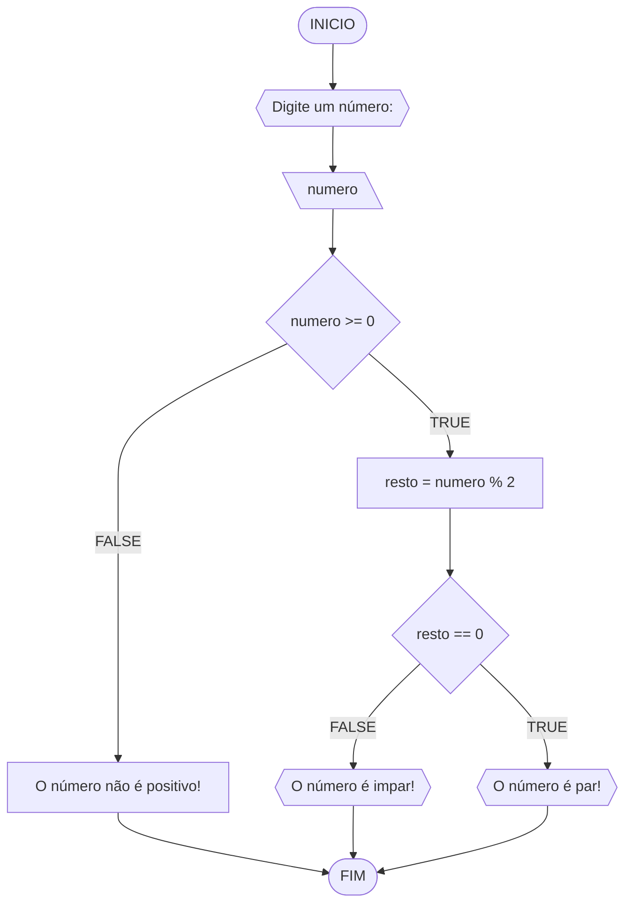
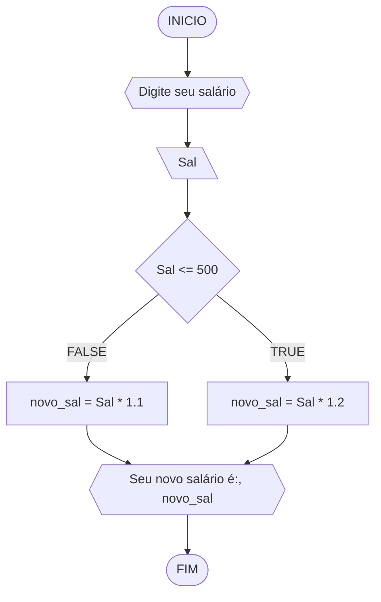
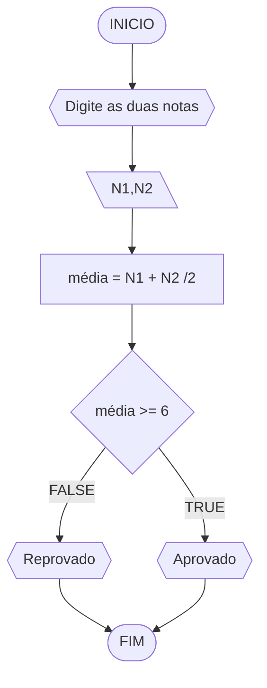
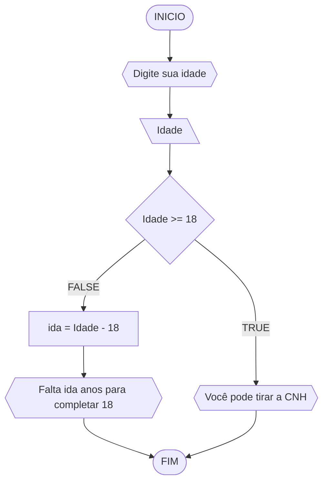

# UNIFOR
**Nome**: Cauã de Norões Milfont Queiroz <br>
**Disciplina**: Raciocínio lógico algorítmico

## Lista de exercícios 01

### Exercício 01 (1 ponto)
Represente, em fluxograma e pseudocódigo, um algoritmo para determinar se um número inteiro e positivo é par ou impar.

#### Fluxograma (0,25 ponto)



#### Pseudocódigo (0,5 ponto)
```
1  ALGORTIMO verifica_par_impar
2  DECLARE numero, resto: INTEIRO
3  ESCREVA "Digite um número: "
4  INICIO
4  LEIA numero
5  SE numero >= 0 ENTAO                  // verifica se o inteiro é positivo
6    resto = numero % 2                 // calcula o resto da divisão por 2
7    SE resto == 0 ENTAO                // verifica se o resto é igual a zero
8      ESCREVA "O número é par!"
9    SENAO
10     ESCREVA "O número é impar!"
11   FIM_SE
11  SENAO                                // caso inteiro for negativo (condição linha 5)
12    ESCREVA "O número deve ser postivo!"
13  FIM_SE
13 FIM
```

#### Teste de mesa (0,25 ponto)
| numero | numero >= 0 | resto | resto == 0 | Saída |
| -- | -- | -- | -- | -- | 
| -1 | F |   |   | "O número deve ser postivo!" |
| 0  | V | 0 | V | "O número é par!" |
| 13 | V | 1 | F | "O número é impar!" |
| 30 | V | 0 | V | "O número é par!" |

## Exercício 02 (3 pontos)
Represente, em fluxograma e pseudocódigo, um algoritmo para calcular o novo salário de um funcionário. 
Sabe-se que os funcionários que recebem atualmente salário de até R$ 500 terão aumento de 20%; os demais terão aumento de 10%.

#### Fluxograma (1.0 ponto)



#### Pseudocódigo (1.0 ponto)

```
1 Algoritmo Calcular_novo_salário
2 DECLARE sálario, Novosalário como real
3 ESCREVA "Digite seu salário: "
4 LEIA sal
5 INICIO
6 SE sal <= 500 ENTÃO                //verificar o aumento baseado no salário atual
7 novo_sal = Sal * 1.2               //aumento de 20% para salários até R$ 500
8 SENÃO                              
9 novo_sal = Sal * 1.1               //aumento de 10% para salários acima de R$ 500
10 FIM_SE
11 ESCREVA "Seu novo salário é: ", novo_sal
12 FIM_ALGORITMO
```

#### Teste de mesa (1.0 ponto)

| salário      | salário <= 500| aumento em % | novo salário| saída | 
|      --      |      --      |      --      |      --      |      --      | 
| 400       | V     | 20% | 480| "Seu novo salário é 480"   |
| 550          | F       | 10%     | 605| "Seu novo salário é 605"  |

## Exercício 03 (3 pontos)
Represente, em fluxograma e pseudocódigo, um algoritmo para calcular a média aritmética entre duas notas de um aluno e mostrar sua situação, que pode ser aprovado ou reprovado.

#### Fluxograma (1 ponto)



#### Pseudocódigo (1 ponto)

```
1 Algoritmo CalcularMédia
2 DECLARE N1, N2, média como real
3 ESCREVA "DIgite as duas notas: "
4 INICIO
5 LEIA N1, N2
6 média = (N1 + N2) / 2
7 SE média >= 6 ENTÃO
8 ESCREVA "Aprovado"
9 SENÃO
10 ESCREVA "Reprovado"
11 FIM_SE
12 FIM_ALGORITMO
```

#### Teste de mesa (1 ponto)

| N1           | N2           |    média    | Média >= 6   | Saída         | 
|      --      |      --      |      --      |      --      |      --      | 
| 6            |              |     F         |              | "Coloque 2 notas!"   |
| 7            | 7            | 7            | V            | "Aprovado" |
|   6          |    4          |  5          |   F           |" Reprovado |
| 5,5          | 6,5            | 6          | V              | "Aprovado"|
## Exercício 04 (3 pontos)
Represente, em fluxograma e pseudocódigo, um algoritmo que, a partir da idade do candidato(a), determinar se pode ou não tirar a CNH. 
Caso não atender a restrição de idade, calcular quantos anos faltam para o candidato estar apto.

#### Fluxograma (1.0 ponto)



#### Pseudocódigo (1.0 ponto)

```
1 Algoritmo IdadeCNH
2 DECLARE Ida, res como Inteiro
3 ESCREVA "Digite sua idade: "          
4 INICIO
5 LEIA Idade
6 SE Idade >= 18 ENTÃO                            // verifica se o inteiro é positivo
7 ESCREVA  "Você pode tirar a CNH"
8 SENÃO
9 ida = Idade - 18
10 ESCREVA " Você não pode tirar a CNH ainda faltam "ida" anos"
11 FIM_SE
12 FIM_ALGORITMO
```

#### Teste de mesa (1.0 ponto)

| Idade        | Idade >= 18 | Pode tirar CNH |Anos restante| Saída | 
|      --      |      --      |      --      |      --      |      --      | 
| 17,5         |              |              |              | "O número deve ser inteiro"   |
| 18  | V      | V        | 0    | "Você pode tirar a CNH!" |
| 16           | F        |F                | 2             |" Você não pode tirar a CNH ainda faltam 2 anos!"|
| 20| V | V| 0| "Você pode tirar a CNH!"
