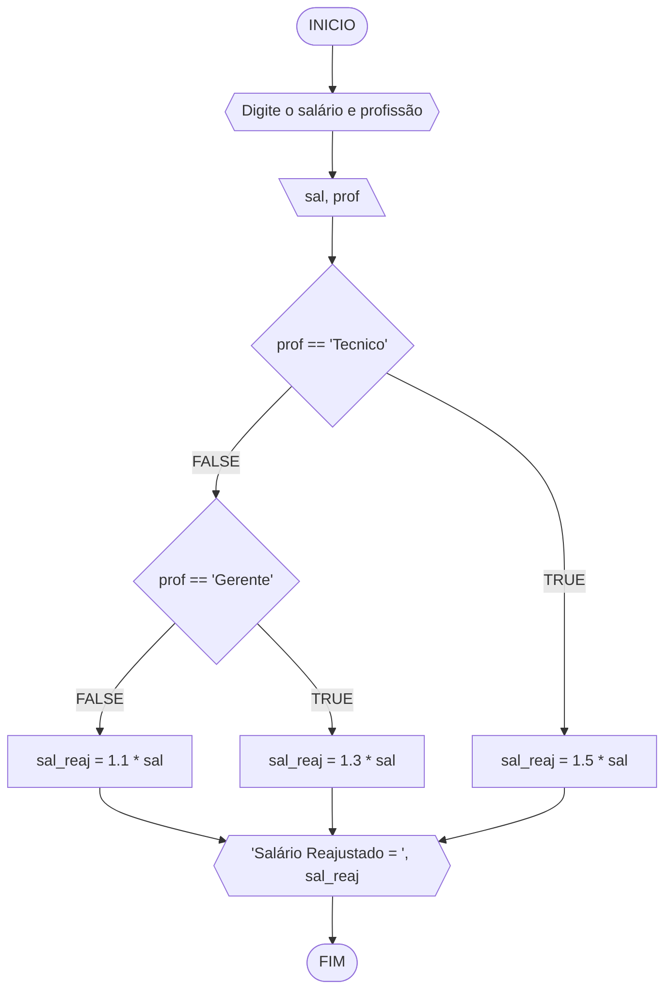
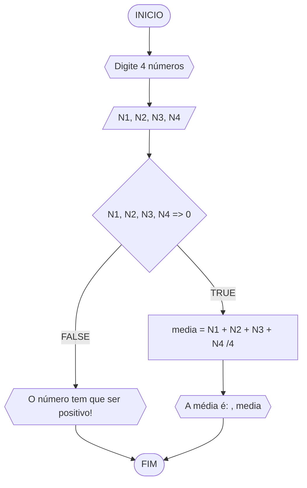
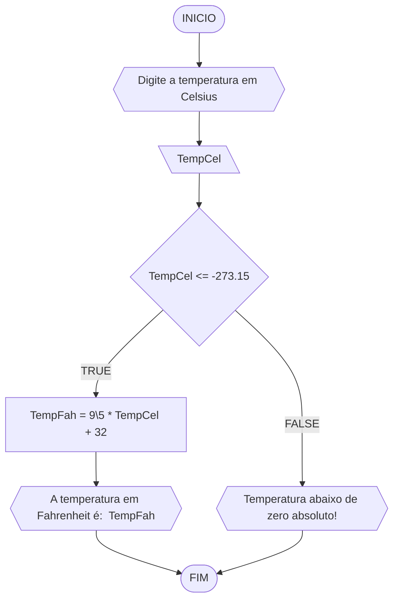
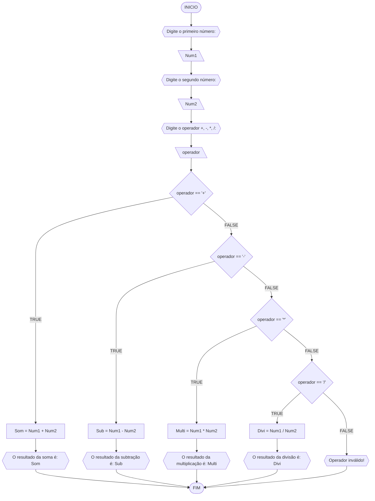
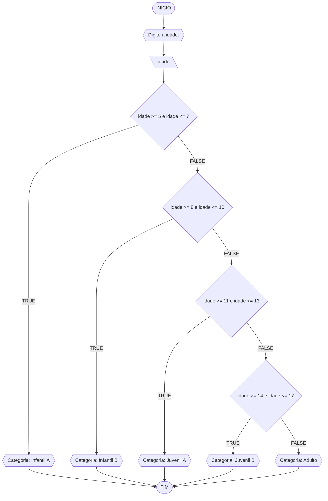

# UNIFOR
**Nome**:Cauã de Norões Milfont Queiroz 
**Disciplina**: Raciocínio lógico algorítm

## Exercício exemplo
Represente, em fluxograma e pseudocódigo, um algoritmo para calcular o adicional de salário de funcionário por cargo de uma empresa fictícia. Sabe-se que os funcionários de cargo técnico receberão reajuste de 50%, cargo de gerência, um reajuste de 30% e demais, um reajuste de 10%. 

#### Fluxograma


#### Pseudocódigo
```
1  ALGORITMO calReajuste
2  DECLARE  sal, sal_reaj: real, prof: caractere
3  INICIO
4 ESCREVA "Digite o sálario e profissão"
5 LEIA sal, prof
6   SE prof == “Técnico”	 ENTÃO
7     sal_reaj ← 1.5 * sal
8 SENÃO
9  SE prof = “Gerente”	ENTÃO	
9     sal_reaj ← 1.3 * sal
10  SENÃO
11    sal_reaj ← 1.1 * sal
12 FIM_SE
13 ESCREVA “Salário Reajustado = “, sal_reaj
14 FIM_ALGORITMO
```

#### Teste
| sal | prof | prof == “Técnico” | prof = “Gerente” | sal_reaj | Saída |
| -- | -- | -- | -- | -- | -- |
| 1000 | Técnico | V | F | 1500 | “Salário Reajustado = 1500“ |
| 2000 | Gerente | F | V | 2600 | “Salário Reajustado = 2600“ |
| 9000 | Diretor | F | F | 9900 | “Salário Reajustado = 9900“ |

## Lista de exercícios 02

### Exercício 01 (2.5 pontos)
Calcule a média de quatro números inteiros dados.

#### Fluxograma (1.0 ponto)



#### Pseudocódigo (1.0 ponto)

```
1 Algoritmo Media
2 DECLARE N1, N2, N3, N4, media: INTEIRO
3 INICIO
4 ESCREVA "Digite 4 números: "
5 LEIA N1, N2, N3, N4
6 SE N1, N2, N3, N4 => 0 ENTÂO
7 media = (N1 + N2 + N3 + N4)/4
8 ESCREVA "A média é: ",media
9 SENÃO
10 ESCREVA "O número tem que ser positivo!"
11 FIM_SE
12 FIM_ALGORITMO
```

#### Teste de mesa (0.5 ponto)

| N1           | N2           | N3           | N4           | >= 0         | Saída    |
|      --      |      --      |      --      |      --      |      --      | |
| 20           | 34           | -2           |  7           | F            |"Escreva um número positivo"|
| 30           | 12           | 06           | 30           | V            |"Sua média é: " media|
| 45           | 25           |45            |              | F            |"Digite 4 números |

### Exercício 02 (2.5 pontos)
Leia uma temperatura dada em Celsius (C) e imprima o equivalente em Fahrenheit (F). (Fórmula de conversão: F = (9/5) * C + 32)

#### Fluxograma (1.0 ponto)



#### Pseudocódigo (1.0 ponto)

```
Algoritmo ConverteCelsiusFarenheit
1 DECLARE TempCel, TempFah, como REAL
2 INICIO
3 ESCREVA "Digite a temperatura em Celsius"
4 LEIA TempCel
5 SE TempCel <= -273.15 ENTÃO
6 TempFah = 9\5 * TempCel + 32
7 ESCREVA "A temperatura em Fahrenheit é: " TempFah
8 SENÃO
9 ESCREVA "Temperatura abaixo de zero absoluto!"
10 FIM_SE
11 FIM_ALGORITMO
```

#### Teste de mesa (0.5 ponto)

| C° | C° <= -273.15 | F° | >= 0 | Saída | 
|      --      |      --      |      --      |      --      |      --      | 
| 13    | V      | 55.4    | V   | "A temperatura é 55.4F°"    |
| -100  | V         | -148        | F|  "A temperatura é -148F°" |
|33     | V      | 91.4 | V| "A Temperatura é 91.4F°"|
|-273.15| F     ||F|"Temperatura abaixo de zero absoluto!"|

### Exercício 03 (2.5 pontos)
Receba dois números reais e um operador e efetue a operação correspondente com os valores recebidos (operandos). 
O algoritmo deve retornar o resultado da operação selecionada simulando todas as operações de uma calculadora simples.

#### Fluxograma (1.0 ponto)



#### Pseudocódigo (1.0 ponto)

```
1 Algoritmo Calculadora
2 DECLARE Num1, Num2, Som, Sub, Multi, Divi: REAL
3 operador: CARACTERE
4 ESCREVA "Digite o primeiro número: "
5 LEIA Num1
6 ESCREVA"Digite o segundo número: "
7 LEIA Num2
8 ESCREVA "Digite o operador (+, -, *, \): "
9 LEIA operador
10 SE operador == '+' ENTÃO
    11  Som = Num1 + Num2
     12 ESCREVA "O resultado da soma é: ", Som
  13 SENÃO SE operador == '-' ENTÃO
     14 Sub = Num1 - Num2
     15 ESCREVA "O resultado da subtração é: ", Sub
 16  SENÃO SE operador == '*' ENTÃO
  17    Multi = Num1 * Num2
     18 ESCREVA "O resultado da multiplicação é: ", Multi
  19 SENÃO SE operador == '/' ENTÃO
    20  SE Num2 != 0 ENTAO
      21   Divi = Num1 / Num2
       22  ESCREVA "O resultado da divisão é: ", Divi
 23  SENÃO
   24   ESCREVA "Operador inválido!"
25   FIM_SE
26 FIM_ALGORITMO
```

#### Teste de mesa (0.5 ponto)

| Número 1 | Número 2         | Operador     | Resultado    | Saída | 
|      --      |      --      |      --      |      --      |      --      | 
| 15           | 20           | +            |  25          |"Resultado da soma é: 25 "   |
| 30           | 15           | -           | 15            | "Resultado da subtração é: 15 " |
|20           | 2             | *          | 40             |"Resultado da multiplicação é: 40"|
|50    | 5        |  \    |   10      |    "Resultado da divisão é: 10 "|
| 20    | 4|   √|  F| "Operador inválido"|

### Exercício 04 (2.5 pontos)
Elaborar um algoritmo que, dada a idade, classifique nas categorias: infantil A (5 - 7 anos), infantil B (8 -10 anos), juvenil A (11 - 13 anos), juvenil B (14 -17 anos) e adulto (maiores que 18 anos).

#### Fluxograma (1.0 ponto)



#### Pseudocódigo (1.0 ponto)

```
Algoritmo ClassificaCategoria
1 DECLARE idade: INTEIRO
2 INICIO
  3 ESCREVA "Digite a idade: "
  4 LEIA idade
 5  SE idade >= 5 E idade <= 7 ENTÃO
     6 ESCREVA "Categoria: Infantil A"
  7 SENÃO
8 SE idade >= 8 E idade <= 10 ENTÃO
    9  ESCREVA "Categoria: Infantil B"
10 SENÃO
11 SE idade >= 11 E idade <= 13 ENTÃO
    12  ESCREVA "Categoria: Juvenil A"
 13  SENÃO
14 SE idade >= 14 E idade <= 17 ENTÃO
     15 ESCREVA "Categoria: Juvenil B"
  16 SENÃO
     17 ESCREVA "Categoria: Adulto"
  18 FIM_SE
 19 FIM_ALGORITMO
```

#### Teste de mesa (0.5 ponto)

| Idade | Infantil | Juvenil | Adulto| Saída | 
|      --      |      --      |      --      |      --      |      --      | 
| 9   | V     | F    |  F     | "Categoria: Infantil B"   |
| 5   | V          | F        | F |"Categoria: Infantil A"  |
| 15  |F          | V        | F | "Categoria: Juvenil B"  |
| 19 | F         | F        | V | "Categoria: Adulto"  |
| 12| F         | V       | F | "Categoria: Juvenil B"  |
